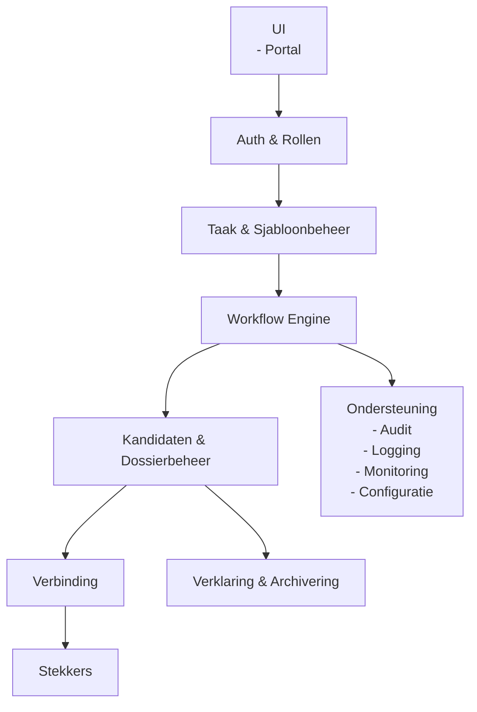

# Architectuur – Vernietigingscockpit

## 1. Doel en scope

Dit document beschrijft de architectuur van de Vernietigingscockpit.
Het document **is normerend bedoeld** en geeft bindende kaders voor ontwerp, implementatie en gebruik.

Doel van dit document is:
- vastleggen van verantwoordelijkheden van de cockpit
- beschrijven van logische opbouw en samenhang
- borgen van functiescheiding en verantwoording
- ondersteunen van compliance en toezicht

Dit document beschrijft **geen** technische implementatiedetails.
Implementaties **moeten** aantoonbaar voldoen aan dit architectuurkader.

## 2. Context en positionering

De Vernietigingscockpit **is** het centrale regie en besluitvormingscomponent binnen het ecosysteem.

De cockpit:
- **moet** regie voeren op selectie en vernietiging
- **moet** normatieve besluiten ondersteunen
- **moet** dossiers en audittrail beheren
- **mag niet** zelf vernietigen of selecteren

De cockpit **communiceert uitsluitend** met stekkers.
Directe communicatie met bronsystemen **is niet toegestaan**.

De cockpit **bevat geen** bron specifieke of LSL interpretatie logica.

## 3. Architectuurprincipes

De volgende principes **zijn bindend** voor de architectuur van de cockpit:

- centrale regie, geen uitvoering
- expliciete functiescheiding
- normatief en operationeel strikt gescheiden
- reproduceerbare besluitvorming
- volledige traceerbaarheid
- configuratie boven maatwerk
- Common Ground en NeRDS uitgangspunten
- open source en transparantie

Afwijkingen **moeten** expliciet gemotiveerd en vastgelegd worden.

## 4. Logisch architectuuroverzicht

De Vernietigingscockpit bestaat uit logisch gescheiden bouwblokken.
Elk bouwblok heeft een expliciete verantwoordelijkheid.

### 4.1 Architectuurdiagram

	
## 5. Componentbeschrijvingen

In dit hoofdstuk worden de logische componenten van de Vernietigingscockpit beschreven.
Elke component heeft een expliciete verantwoordelijkheid.
Overlap tussen componenten is niet toegestaan.

### 5.1 UI

Dit component vormt de gebruikersinterface.
Het component:
- **moet** taken, kandidaten en status tonen
- **moet** toelichtingen en uitsluitingen ondersteunen
- **moet** historie en voortgang inzichtelijk maken
- **mag geen** selectie of vernietigingslogica bevatten

De UI ondersteunt meerdere rollen, maar **stuurt geen** besluitvorming buiten de workflow om.

### 5.2 Authenticatie en Rollen

Dit component **moet** identiteit en autorisatie afdwingen.
Het:
- **moet** rollen expliciet onderscheiden
- **moet** functiescheiding afdwingen
- **mag geen** workflowstappen kunnen overslaan

Integratie met een centrale IAM voorziening **is verplicht**.

### 5.3 Taak en Sjabloonbeheer

Dit component **beheert** vernietigingstaken.
Het:
- **moet** sjablonen ondersteunen
- **moet** taken reproduceerbaar maken
- **moet** frequentie en planning vastleggen
- **mag geen** bron of stekkerlogica bevatten

Taken **zijn procesmatig** en niet technisch van aard.

### 5.4 Workflow Engine

De workflow engine **stuurt** het vernietigingsproces.
De workflow:
- **moet** de vaste volgorde van stappen afdwingen
- **moet** functiescheiding borgen
- **mag geen** stappen overslaan of combineren

De workflow **moet minimaal bestaan uit**:
- beoordeling door recordmanager
- accordering door proceseigenaar
- finale accordering door archivaris

### 5.5 Kandidaten en Dossierbeheer

Dit component **beheert het vernietigingsdossier**.
Het:
- **moet** kandidatenlijsten opslaan
- **moet** uitsluitingen met toelichting vastleggen
- **moet** versies en wijzigingen registreren
- **mag geen** inhoudelijke besluiten wijzigen

Het dossier **vormt** het primaire audit en verantwoordingsbewijs.

### 5.6 Stekker Connectie

Dit component **verzorgt** alle communicatie met stekkers.
Het:
- **moet** via uniforme contracten communiceren
- **moet** resultaten per object verwerken
- **mag geen** stekker of bron specifieke aannames bevatten

Afwijkingen per stekker **mogen niet** doorwerken in de cockpit.

### 5.7 Stekkers

Stekkers zijn externe uitvoerende componenten.
De cockpit:
- **mag geen** kennis hebben van interne stekkerlogica
- **mag uitsluitend** via contract communiceren
- **moet** stekkers als verwisselbaar behandelen

### 5.8 Ondersteuning

Ondersteunende voorzieningen:
- **moeten** logging leveren
- **moeten** monitoring ondersteunen
- **moeten** configuratie mogelijk maken

Alle normatieve handelingen **moeten** worden gelogd.

### 5.9 Verklaring en Archivering

Na afronding van een taak **moet** een verklaring van vernietiging worden gegenereerd.
Deze verklaring:
- **moet** alle accorderingen bevatten
- **moet** uitvoeringsresultaten bevatten
- **moet** worden gearchiveerd als zaak

Zonder verklaring **is het proces niet afgerond**.

## 6. Interactie en verantwoordelijkheden

De cockpit:
- **moet** regie voeren en besluiten vastleggen
- **mag niet** selecteren of vernietigen
- **moet** transparantie en controle bieden

Stekkers:
- **moeten** selecteren en vernietigen
- **leveren** technische resultaten terug

Deze verantwoordelijkheden **mogen niet** overlappen.

## 7. Niet functionele eisen

De Vernietigingscockpit **moet** voldoen aan:
- schaalbaarheid
- betrouwbaarheid en herstartbaarheid
- sterke autorisatie en functiescheiding
- volledige audit en logging
- beheerbaarheid en transparantie

Deze eisen **zijn bindend** voor elke implementatie.

## 8. Versies en compatibiliteit

De cockpit **moet** meerdere stekkerversies parallel ondersteunen.
Wijzigingen:
- **mogen niet** brekend zijn binnen een major versie
- **moeten** additief zijn
- **moeten** historische reproduceerbaarheid borgen

Versieinformatie **moet** worden vastgelegd in dossiers.

## 9. Aannames en openstaande keuzes

### 9.1 Aannames

- de cockpit bevat geen LSL logica
- stekkers leveren uitvoeringsresultaten per object
- archivering vindt plaats in een zaaksysteem

Deze aannames **moeten** expliciet worden gevalideerd bij implementatie.

### 9.2 Openstaande keuzes

- mate van asynchrone communicatie
- detailniveau van auditlogging
- API ontsluiting voor externe systemen