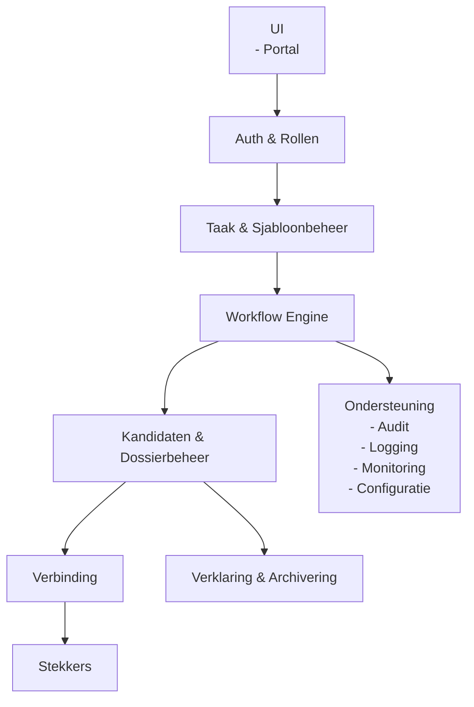

# Architectuur – Vernietigingscockpit

## 1. Doel en scope

Dit document beschrijft de architectuur van de Vernietigingscockpit.
Het document **is normerend bedoeld** en geeft bindende kaders voor ontwerp, implementatie en gebruik.

Doel van dit document is:
- vastleggen van verantwoordelijkheden van de cockpit
- beschrijven van logische opbouw en samenhang
- borgen van functiescheiding en verantwoording
- ondersteunen van compliance en toezicht

Dit document beschrijft **geen** technische implementatiedetails.
Implementaties **moeten** aantoonbaar voldoen aan dit architectuurkader.

## 2. Context en positionering

De Vernietigingscockpit **is** het centrale regie en besluitvormingscomponent binnen het ecosysteem.

De cockpit:
- **moet** regie voeren op selectie en vernietiging
- **moet** normatieve besluiten ondersteunen
- **moet** verantwoording (audittrail, uitsluitingen, toelichtingen) van vernietigingsprocessen beheren
- **mag niet** zelf vernietigen of selecteren

De cockpit **communiceert uitsluitend** met stekkers.
Directe communicatie met bronsystemen **is niet toegestaan**.

De cockpit **bevat geen** bronsysteem specifieke of landelijke selectielijst interpretatie logica.

## 3. Architectuurprincipes

Naast de algehele architectuurprincipes, zijn aanvullende volgende principes **bindend** voor de architectuur van de cockpit:

- De cockpit **is gebruiksvriendelijk en toegankelijk, en voldoet aan de geldende WCAG-norm**
- de cockpit **is de enige plek waar normatieve besluitvorming plaatsvindt en wordt vastgelegd**
- de cockpit **maakt alle besluiten expliciet, herleidbaar en onveranderbaar na vastlegging**
- de cockpit **waarborgt dat elke actie terug te voeren is op een expliciet besluit en bevoegde actor**
- de cockpit **scheidt strikt processturing van technische uitvoering en bewaakt deze scheiding actief**
- de cockpit **dwingt volledige procesintegriteit af** (geen impliciete stappen, geen bypasses, geen verborgen paden)
- de cockpit **waarborgt functiescheiding en rolzuiverheid in elke stap van het proces**
- de cockpit **legt de volledige context van besluitvorming vast** (input, overwegingen, uitzonderingen, accorderingen)
- de cockpit **beheert het vernietigingsdossier als primaire bronsysteem van waarheid voor verantwoording**
- de cockpit **garandeert dat historische processen volledig reproduceerbaar en controleerbaar blijven**
- de cockpit **maakt verschillen tussen besluit en uitvoering expliciet zichtbaar**
- de cockpit **gaat expliciet om met onzekerheden, afwijkingen en uitzonderingen in het proces**
- de cockpit **beperkt zich tot regie, vastlegging en verantwoording en vermijdt elke vorm van operationele interpretatie**
- de cockpit **is onafhankelijk van gegevensbron- en stekkerspecifieke implementaties en abstraheert deze via uniforme contracten**
- de cockpit **ondersteunt transparantie richting toezicht, controle en audit zonder aanvullende interpretatie**
- de cockpit **waarborgt dat geen vernietiging kan plaatsvinden zonder volledig en afgerond dossier**
- de cockpit **maakt alle relevante proces- en besluitinformatie exporteerbaar en deelbaar binnen governancekaders**
- de cockpit **voorkomt impliciete of niet-gelogde gebruikersinteracties die invloed hebben op besluitvorming**

Afwijkingen **moeten** expliciet gemotiveerd en vastgelegd worden.

## 4. Logisch architectuuroverzicht

De Vernietigingscockpit bestaat uit logisch gescheiden bouwblokken.
Elk bouwblok heeft een expliciete verantwoordelijkheid.

### 4.1 Architectuurdiagram

	
## 5. Componentbeschrijvingen

In dit hoofdstuk worden de logische componenten van de Vernietigingscockpit beschreven.
Elke component heeft een expliciete verantwoordelijkheid.
Overlap tussen componenten is niet toegestaan.

### 5.1 UI

Dit component vormt de gebruikersinterface voor het definiëren, uitvoeren, analyseren en verantwoorden van vernietigingstaken binnen een gedefinieerde workflow.

Het component:
- **moet** takengericht werken
- **moet** taken, vernietigingskandidaten en status tonen
- **moet** toelichtingen en uitsluitingen ondersteunen
- **moet** het proces rondom besluitvorming faciliteren
- **moet** historie en voortgang inzichtelijk maken
- **mag geen** selectie of vernietigingslogica bevatten

De UI ondersteunt meerdere rollen, maar **stuurt geen** besluitvorming buiten de workflow om. Alle UI-functionaliteiten worden vastgelegd in een apart design document.

### 5.2 Authenticatie en Rollen

Dit component **moet** identiteit en autorisatie afdwingen.
Het:
- **moet** rollen expliciet onderscheiden
- **moet** functiescheiding afdwingen
- **mag geen** workflowstappen kunnen overslaan

Integratie met een centrale IAM voorziening **is verplicht**.

### 5.3 Taak en Sjabloonbeheer

Dit component **beheert** vernietigingstaken.
Het:
- **moet** sjablonen ondersteunen
- **moet** taken reproduceerbaar maken
- **moet** frequentie en planning vastleggen
- **mag geen** bronsysteem of stekkerlogica bevatten

Taken **zijn procesmatig** en niet technisch van aard.

### 5.4 Workflow Engine

De workflow engine **stuurt** het vernietigingsproces.
De workflow:
- **moet** de vaste volgorde van stappen afdwingen
- **moet** functiescheiding borgen
- **mag geen** stappen overslaan of combineren

De workflow **moet minimaal bestaan uit**:
- beoordeling door recordmanager
- accordering door proceseigenaar
- finale accordering door archivaris

### 5.5 Vernietigingskandidaten en Dossierbeheer

Dit component **beheert het vernietigingsdossier**.
Het:
- **moet** aangeleverde lijsten met vernietigingskandidaten vastleggen
- **moet** uitsluitingen met toelichting vastleggen
- **moet** versies en wijzigingen registreren
- **mag geen** inhoudelijke besluiten wijzigen

Het vernietigingsdossier **vormt** het primaire audit en verantwoordingsbewijs.

### 5.6 Stekkerkoppeling

Dit component **verzorgt** alle communicatie met stekkers.
Het:
- **moet** via uniforme contracten communiceren
- **moet** uitvoeringsresultaten per informatieobject verwerken
- **mag geen** stekker- of bronsysteem specifieke aannames bevatten

Afwijkingen per stekker **mogen niet** doorwerken in de cockpit.

### 5.7 Stekkers

Stekkers zijn uitvoerende componenten waarmee de cockpit via uniforme contracten communiceert.
De cockpit:
- **mag geen** kennis hebben van interne stekkerlogica
- **mag uitsluitend** via contract communiceren
- **moet** stekkers als verwisselbaar behandelen

### 5.8 Ondersteuning

Ondersteunende voorzieningen:
- **moeten** logging leveren
- **moeten** monitoring ondersteunen
- **moeten** configuratie mogelijk maken

Alle normatieve handelingen **moeten** worden gelogd.

### 5.9 Verklaring en Archivering

Na afronding van een taak **moet** een verklaring van vernietiging worden gegenereerd.
Deze verklaring:
- **moet** alle accorderingen bevatten
- **moet** uitvoeringsresultaten bevatten
- **moet** worden gearchiveerd in een daarvoor aangewezen archief- of zaaksysteem
- **moet** deelbaar zijn (download)

Zonder verklaring **is het proces niet afgerond**.

## 6. Interactie en verantwoordelijkheden

De cockpit:
- **moet** regie voeren en besluiten vastleggen
- **mag niet** selecteren of vernietigen
- **moet** transparantie en controle bieden

Stekkers:
- **moeten** vernietigingskandidaten bepalen
- **moeten** vernietiging technisch uitvoeren of laten uitvoeren via bronsystemen
- **moeten** uitvoeringsresultaten per aangeboden informatieobject terugleveren

Deze verantwoordelijkheden **mogen niet** overlappen.

## 7. Niet functionele eisen

De volgende eisen zijn aanvullend op de generieke niet-functionele eisen uit het architectuurkader en specifiek voor de rol van de Vernietigingscockpit.

### Besluitvorming en integriteit
- de cockpit **moet** de integriteit van besluitvorming waarborgen (geen impliciete of ongeautoriseerde besluiten)  
- de cockpit **moet** voorkomen dat processtappen worden overgeslagen of buiten de workflow om plaatsvinden  
- de cockpit **moet** afdwingen dat alleen bevoegde rollen besluiten kunnen nemen  

### Dossierintegriteit en onveranderbaarheid
- de cockpit **moet** het vernietigingsdossier volledig, samenhangend en onveranderbaar vastleggen
- de cockpit **moet** alle wijzigingen versioneren en historisch inzichtelijk maken  
- de cockpit **mag geen** verlies van dossierinformatie toestaan  

### Reproduceerbaarheid en audit
- de cockpit **moet** volledige reproduceerbaarheid van processen en besluiten mogelijk maken  
- de cockpit **moet** alle relevante context van besluitvorming vastleggen (input, overwegingen, accorderingen)  
- de cockpit **moet** auditinformatie zodanig vastleggen dat externe controle zonder interpretatie mogelijk is  

### Consistentie tussen besluit en uitvoering
- de cockpit **moet** kunnen aantonen welke besluiten hebben geleid tot welke uitvoeringsopdrachten  
- de cockpit **moet** verschillen tussen besluit en uitvoeringsresultaat zichtbaar maken  
- de cockpit **mag geen** onverklaarbare discrepanties toestaan  

### Procescontrole en voortgang
- de cockpit **moet** actueel inzicht geven in status, voortgang en blokkades  
- de cockpit **moet** deterministische workflow-uitvoering waarborgen  
- de cockpit **moet** herstel en herstart van processen ondersteunen zonder verlies van consistentie  

### Transparantie en uitlegbaarheid
- de cockpit **moet** besluitvorming en procesverloop inzichtelijk en uitlegbaar maken voor gebruikers en toezichthouders  
- de cockpit **moet** expliciet omgaan met uitzonderingen, afwijkingen en onzekerheden  
- de cockpit **mag geen** verborgen processtappen of impliciete logica bevatten  

### Samenwerking en accordering
- de cockpit **moet** consistente samenwerking ondersteunen tussen rollen binnen dezelfde taak  
- de cockpit **moet** accorderingsstappen volledig traceerbaar maken (wie, wat, wanneer)  
- de cockpit **moet** gelijktijdige bewerking beheerst ondersteunen (concurrency control)  

### Export en bewijsvoering
- de cockpit **moet** alle relevante informatie exporteerbaar maken voor verantwoording en archivering  
- de cockpit **moet** verklaringen en onderliggende gegevens volledig en in samenhang genereren 
- de cockpit **moet** waarborgen dat geëxporteerde informatie overeenkomt met het dossier  

### Configuratie en voorspelbaarheid
- de cockpit **moet** voorspelbaar gedrag vertonen op basis van configuratie en workflowdefinitie  
- de cockpit **moet** configuratieversies expliciet vastleggen en toepassen  
- de cockpit **mag geen** verborgen of impliciete configuratie gebruiken  

### Onafhankelijkheid en robuustheid
- de cockpit **moet** functioneren onafhankelijk van individuele stekkers of bronsystemen  
- de cockpit **moet** omgaan met gedeeltelijke beschikbaarheid van stekkers  
- de cockpit **moet** fouten in externe componenten isoleren van besluitvorming en dossieropbouw  

Deze eisen **zijn bindend** voor elke implementatie.

## 8. Versies en compatibiliteit

De cockpit **moet** meerdere stekkerversies parallel ondersteunen.

Als uitgangspunt geldt ondersteuning van de actuele stekkerversie en maximaal twee eerdere ondersteunde versies, tenzij hierover andere beheerafspraken zijn vastgelegd.

Wijzigingen:
- **mogen niet** brekend zijn binnen een major versie
- **moeten** additief zijn
- **moeten** historische reproduceerbaarheid borgen

Versieinformatie **moet** worden vastgelegd in vernietigingsdossiers.

## 9. Aannames en openstaande keuzes

### 9.1 Aannames

- de cockpit bevat geen landelijke selectielijst logica
- stekkers leveren uitvoeringsresultaten per aangeboden informatieobject
- archivering vindt plaats in een archiefsysteem, zoals een zaaksysteem

Deze aannames **moeten** expliciet worden gevalideerd bij implementatie.

### 9.2 Openstaande keuzes
- mate van asynchrone communicatie
- detailniveau van auditlogging
- API ontsluiting voor externe systemen