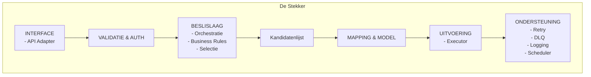

# Architectuur – De Stekker

## 1. Doel en scope

Dit document beschrijft de architectuur van de Stekker.
De Stekker is de gestandaardiseerde technische schakel tussen de Vernietigingscockpit en de feitelijke gegevensbronnen.

Dit document **is normerend bedoeld**.
Implementaties van stekkers **moeten** aantoonbaar voldoen aan dit architectuurkader.

De scope van dit document omvat:
- selectie van vernietigingskandidaten
- operationele interpretatie van regels
- technische uitvoering van vernietiging
- foutafhandeling en statusregistratie

De interne architectuur van de cockpit en de gegevensbronnen valt buiten scope.

## 2. Context en positionering

De Stekker bevindt zich tussen de Vernietigingscockpit en een of meerdere gegevensbronnen.

- De cockpit **mag alleen** communiceren met de Stekker
- De Stekker **mag alleen** communiceren met gegevensbronnen
- De cockpit **mag niet** direct communiceren met gegevensbronnen

Per applicatietype of applicatiefamilie **moet** in principe een Stekker bestaan.
Tenant of instantie specifieke verschillen **moeten** via configuratie worden opgelost, niet via code varianten.

De Stekker combineert normatieve context uit de cockpit met operationele uitvoering tegen de gegevensbron.

### 2.1 Verschijningsvormen van de Stekker

De Stekker is een logisch patroon en kent meerdere geldige verschijningsvormen.

Een Stekker **kan zelfstandig bestaan**:
- als aparte component
- werkend bovenop eenvoudige of legacy gegevensbronnen
- beheerd los van de gegevensbronnen

Een Stekker **kan ook geïntegreerd zijn**:
- als onderdeel van een taakapplicatie
- ontwikkeld en beheerd door een leverancier
- zonder aparte deployment als zelfstandige service

Deze verschijningsvormen zijn architecturaal gelijkwaardig. In alle gevallen gelden dezelfde verantwoordelijkheden, hetzelfde contract richting de cockpit en dezelfde scheiding tussen normatief en operationeel.

## 3. Architectuurprincipes

Naast de algehele architectuurprincipes, zijn aanvullende volgende principes **bindend** voor de architectuur van de Stekker:

- de stekker **scheidt strikt normatieve input van operationele verwerking en maakt deze scheiding expliciet in alle lagen**
- de stekker **voert alle operationele beslissingen expliciet en uitlegbaar uit per informatieobject**
- de stekker **garandeert dat selectie en vernietiging deterministisch en reproduceerbaar zijn binnen dezelfde context**
- de stekker **legt de volledige operationele context vast bij elke selectie en uitvoering** (regels, parameters, peildatum, versie, bronstatus)
- de stekker **waarborgt dat selectie en uitvoering altijd herleidbaar zijn tot een specifieke taakinstantie en besluit uit de cockpit**
- de stekker **voert vernietiging uitsluitend uit op expliciet vrijgegeven en ongewijzigde kandidaten**
- de stekker **detecteert en signaleert afwijkingen tussen selectie en uitvoering** (bijv. gewijzigde brondata)
- de stekker **isoleert alle bron-specifieke variatie en inconsistentie van het uniforme procesmodel**
- de stekker **maakt onzekerheden, ontbrekende data en interpretatieverschillen expliciet zichtbaar**
- de stekker **garandeert dat geen gegevens verloren gaan zonder expliciete registratie van resultaat en reden**
- de stekker **ondersteunt volledige herstartbaarheid zonder verlies van consistentie of auditinformatie**
- de stekker **waarborgt consistente statusvoering per informatieobject over de volledige levenscyclus**
- de stekker **is in staat om gedeeltelijke resultaten veilig en controleerbaar op te leveren**
- de stekker **beperkt impact van fouten tot het kleinst mogelijke niveau (bij voorkeur per object)**
- de stekker **maakt alle externe interacties met bronnen expliciet, traceerbaar en controleerbaar**
- de stekker **waarborgt dat configuratiegedrag transparant, versieerbaar en reproduceerbaar is**
- de stekker **voorkomt impliciete of verborgen logica buiten de gedefinieerde bouwblokken**

Afwijkingen **moeten** expliciet gemotiveerd en vastgelegd worden.

## 4. Logisch architectuuroverzicht

De Stekker is logisch opgebouwd uit samenhangende bouwblokken.
Elk bouwblok heeft een expliciete verantwoordelijkheid.
Bouwblokken **mogen geen** verantwoordelijkheden van elkaar overnemen.

### 4.1 Architectuurdiagram

## 5. Componentbeschrijvingen

Elke component binnen de Stekker heeft een expliciete verantwoordelijkheid.
Overlapping is niet toegestaan.

### 5.1 Interface (API Adapter)

De interface **is** het enige aanspreekpunt voor de cockpit.
Deze component:
- **moet** een stabiel contract aanbieden
- **moet** synchrone en asynchrone interactie ondersteunen
- **mag geen** interne structuren blootstellen

### 5.2 Validatie en Authenticatie

Deze component:
- **moet** technische validatie uitvoeren
- **moet** identiteit en autorisatie afdwingen
- **mag geen** ongeautoriseerde acties doorlaten

### 5.3 Beslislaag en Orchestratie

De beslislaag:
- **moet** de volgorde van stappen bepalen
- **moet** processen coordineren
- **mag geen** normatieve besluiten nemen

### 5.4 Business Rules

Business rules:
- **moeten** bepalen of informatieobjecten vernietigbaar zijn
- **moeten** bewaartermijnen en uitzonderingen toepassen
- **mogen niet** door de cockpit worden uitgevoerd

### 5.5 Selectie

De selectie:
- **moet** vernietigingskandidaten bepalen op basis van regels en gegevensbronnen
- **moet** herhaalbaar en controleerbaar zijn

### 5.6 Kandidatenlijst

De kandidatenlijst:
- **moet** operationele vernietigingskandidaten bevatten
- **moet** status per informatieobject ondersteunen
- **moet** batch en herstarts ondersteunen

### 5.7 Mapping en Model

Mapping en model:
- **moeten** gegevensbronnen vertalen naar een uniform intern model
- **mogen** gegevensbronverschillen afdekken
- **mogen geen** normatieve logica bevatten

### 5.8 Uitvoering (Executor)

De executor:
- **moet** vernietiging technisch uitvoeren
- **moet** idempotent werken
- **moet** per informatieobject resultaat retourneren

### 5.9 Ondersteuning

Ondersteuning:
- **moet** retries en foutafhandeling leveren
- **moet** logging en audit ondersteunen
- **moet** scheduling faciliteren

## 6. Interactie en verantwoordelijkheden

- De Stekker **selecteert en vernietigt**
- De cockpit **beslist en verantwoordt**
- De gegevensbron **voert de feitelijke acties uit**

Deze verantwoordelijkheden **mogen niet** overlappen.

## 7. Niet functionele eisen

De volgende eisen zijn aanvullend op de generieke niet-functionele eisen uit het architectuurkader en specifiek voor de rol van de Stekker.

### Determinisme en reproduceerbaarheid
- de stekker **moet** bij gelijke input en context identieke selectieresultaten opleveren  
- de stekker **moet** selectie en uitvoering reproduceerbaar maken op basis van vastgelegde context  
- de stekker **moet** expliciet omgaan met peildata en tijdsafhankelijkheid  

### Consistentie tussen selectie en uitvoering
- de stekker **moet** waarborgen dat vernietiging plaatsvindt op dezelfde set als geselecteerd  
- de stekker **moet** afwijkingen tussen selectie en uitvoering detecteren en rapporteren  
- de stekker **mag niet** stilzwijgend objecten toevoegen of overslaan  

### Objectniveau traceerbaarheid
- de stekker **moet** status en resultaat per informatieobject vastleggen  
- de stekker **moet** alle acties per object herleidbaar maken  
- de stekker **moet** correlatie met cockpit-taak en besluit mogelijk maken  

### Herstartbaarheid en idempotentie
- de stekker **moet** processen veilig kunnen hervatten zonder inconsistentie  
- de stekker **moet** dubbele uitvoering voorkomen of veilig afhandelen  
- de stekker **moet** partiële verwerking ondersteunen zonder verlies van controle  

### Foutafhandeling en robuustheid
- de stekker **moet** fouten expliciet maken en classificeren  
- de stekker **moet** gedeeltelijke resultaten kunnen opleveren  
- de stekker **moet** falen van individuele objecten isoleren van de rest van de verwerking  

### Interactie met bronsystemen
- de stekker **moet** omgaan met beperkingen van bronsystemen (rate limits, beschikbaarheid, inconsistentie)  
- de stekker **mag** bronsystemen niet overbelasten of blokkeren  
- de stekker **moet** externe afhankelijkheden expliciet maken in logging en status  

### Observability en correlatie
- de stekker **moet** alle interacties met bronsystemen loggen  
- de stekker **moet** end-to-end tracing ondersteunen (correlatie-id’s)  
- de stekker **moet** inzicht geven in voortgang en tussenstatussen  

### Configuratie en voorspelbaarheid
- de stekker **moet** voorspelbaar gedrag vertonen op basis van configuratie  
- de stekker **moet** configuratieversies expliciet vastleggen en toepassen  
- de stekker **mag geen** verborgen of impliciete configuratie gebruiken  

### Schaal en performance (operationeel specifiek)
- de stekker **moet** grote datasets gefaseerd kunnen verwerken (batch/paginering)  
- de stekker **moet** asynchrone verwerking ondersteunen waar nodig  
- de stekker **moet** verwerking kunnen spreiden om impact op bronnen te beperken  

## 8. Versies en compatibiliteit

De Stekker:
- **moet** backward compatible zijn
- **mag geen** brekende wijzigingen bevatten binnen een major versie
- **moet** versieinformatie expliciet rapporteren

## 9. Aannames en openstaande keuzes

### 9.1 Aannames
- landelijke selectielijst logica bevindt zich in de Stekker
- bronnen ondersteunen fysieke vernietiging

### 9.2 Openstaande keuzes
- mate van asynchrone verwerking
- detaillering van uitvoeringsbewijzen