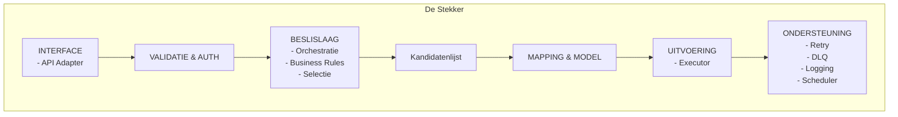

# Architectuur – De Stekker

## 1. Doel en scope

Dit document beschrijft de architectuur van de Stekker.
De Stekker is de gestandaardiseerde technische schakel tussen de Vernietigingscockpit en bronsystemen.

Dit document **is normerend bedoeld**.
Implementaties van stekkers **moeten** aantoonbaar voldoen aan dit architectuurkader.

De scope van dit document omvat:
- selectie van vernietigingskandidaten
- operationele interpretatie van regels
- technische uitvoering van vernietiging
- foutafhandeling en statusregistratie

De interne architectuur van de cockpit en de bronsystemen valt buiten scope.

## 2. Context en positionering

De Stekker bevindt zich tussen de Vernietigingscockpit en een of meerdere bronsystemen.

- De cockpit **mag alleen** communiceren met de Stekker
- De Stekker **mag alleen** communiceren met bronsystemen
- De cockpit **mag niet** direct communiceren met bronnen

Per applicatietype of applicatiefamilie **moet** in principe een Stekker bestaan.
Tenant of instantie specifieke verschillen **moeten** via configuratie worden opgelost, niet via code varianten.

De Stekker combineert normatieve context uit de cockpit met operationele uitvoering tegen de bron.

### 2.1 Verschijningsvormen van de Stekker

De Stekker is een logisch patroon en kent meerdere geldige verschijningsvormen.

Een Stekker **kan zelfstandig bestaan**:
- als aparte component
- werkend bovenop eenvoudige of legacy databronnen
- beheerd los van het bronsysteem

Een Stekker **kan ook geïntegreerd zijn**:
- als onderdeel van een taakapplicatie
- ontwikkeld en beheerd door een leverancier
- zonder aparte deployment als zelfstandige service

Deze verschijningsvormen zijn architecturaal gelijkwaardig. In alle gevallen gelden dezelfde verantwoordelijkheden, hetzelfde contract richting de cockpit en dezelfde scheiding tussen normatief en operationeel.

## 3. Architectuurprincipes

De architectuur van de Stekker **moet** voldoen aan de volgende principes:

- scheiding tussen normatief en operationeel
- stabiel en uniform contract richting cockpit
- idempotente en herhaalbare uitvoering
- configuratie boven maatwerk
- expliciete audit en traceerbaarheid
- backward compatibility binnen major versies
- security by default
- Common Ground en NeRDS uitgangspunten

Afwijkingen **moeten** expliciet worden gemotiveerd en vastgelegd.

## 4. Logisch architectuuroverzicht

De Stekker is logisch opgebouwd uit samenhangende bouwblokken.
Elk bouwblok heeft een expliciete verantwoordelijkheid.
Bouwblokken **mogen geen** verantwoordelijkheden van elkaar overnemen.

### 4.1 Architectuurdiagram

## 5. Componentbeschrijvingen

Elke component binnen de Stekker heeft een expliciete verantwoordelijkheid.
Overlapping is niet toegestaan.

### 5.1 Interface (API Adapter)

De interface **is** het enige aanspreekpunt voor de cockpit.
Deze component:
- **moet** een stabiel contract aanbieden
- **moet** synchrone en asynchrone interactie ondersteunen
- **mag geen** interne structuren blootstellen

### 5.2 Validatie en Authenticatie

Deze component:
- **moet** technische validatie uitvoeren
- **moet** identiteit en autorisatie afdwingen
- **mag geen** ongeautoriseerde acties doorlaten

### 5.3 Beslislaag en Orchestratie

De beslislaag:
- **moet** de volgorde van stappen bepalen
- **moet** processen coordineren
- **mag geen** normatieve besluiten nemen

### 5.4 Business Rules

Business rules:
- **moeten** bepalen of objecten vernietigbaar zijn
- **moeten** bewaartermijnen en uitzonderingen toepassen
- **mogen niet** door de cockpit worden uitgevoerd

### 5.5 Selectie

De selectie:
- **moet** kandidaten bepalen op basis van regels en brondata
- **moet** herhaalbaar en controleerbaar zijn

### 5.6 Kandidatenlijst

De kandidatenlijst:
- **moet** operationele kandidaten bevatten
- **moet** status per object ondersteunen
- **moet** batch en herstarts ondersteunen

### 5.7 Mapping en Model

Mapping en model:
- **moeten** brondata vertalen naar een uniform intern model
- **mogen** bronverschillen afdekken
- **mogen geen** normatieve logica bevatten

### 5.8 Uitvoering (Executor)

De executor:
- **moet** vernietiging technisch uitvoeren
- **moet** idempotent werken
- **moet** per object resultaat retourneren

### 5.9 Ondersteuning

Ondersteuning:
- **moet** retries en foutafhandeling leveren
- **moet** logging en audit ondersteunen
- **moet** scheduling faciliteren

## 6. Interactie en verantwoordelijkheden

- De Stekker **selecteert en vernietigt**
- De cockpit **beslist en verantwoordt**
- De bron **voert fysieke acties uit**

Deze verantwoordelijkheden **mogen niet** overlappen.

## 7. Niet functionele eisen

De Stekker **moet** voldoen aan:
- schaalbaarheid
- betrouwbaarheid en herstartbaarheid
- security en autorisatie
- volledige audit en logging
- beheerbaarheid via configuratie

## 8. Versies en compatibiliteit

De Stekker:
- **moet** backward compatible zijn
- **mag geen** brekende wijzigingen bevatten binnen een major versie
- **moet** versieinformatie expliciet rapporteren

## 9. Aannames en openstaande keuzes

### 9.1 Aannames
- landelijke selectielijst logica bevindt zich in de Stekker
- bronnen ondersteunen fysieke vernietiging

### 9.2 Openstaande keuzes
- mate van asynchrone verwerking
- detaillering van uitvoeringsbewijzen