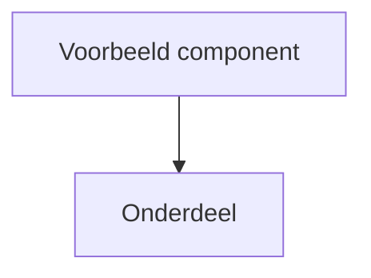

# Template voor uniformiteit
- Eén herkenbare structuur over alle documenten
- Geschikt voor groei, verdieping en community bijdragen
- Architectuur, niet implementatie
- Past goed bij open source en GitHub reading flow
- Mermaid diagrammen zijn direct renderbaar

# Architectuur – ..naam component..

## 1. Doel en scope
Beschrijf het doel van dit document.
Voor wie is het bedoeld, architecten, ontwikkelaars, stakeholders.
Wat valt binnen scope en wat expliciet niet.

## 2. Context en positionering
Plaats dit component binnen de totale Vernietigingscockpit architectuur.
Beschrijf de relatie met andere componenten zoals cockpit, stekkers en bronnen.
Geef aan welke verantwoordelijkheden hier liggen.

## 3. Architectuurprincipes
Beschrijf de belangrijkste principes die richtinggevend zijn.
Bijvoorbeeld:
- scheiding van verantwoordelijkheden
- normatief versus operationeel
- backward compatibility
- security by default
- Common Ground en NeRDS

## 4. Logisch architectuuroverzicht
Introduceer de hoofdbouwblokken op logisch niveau.
Dit is een conceptueel overzicht, los van technische implementatie.

### 4.1 Architectuurdiagram
Gebruik een Mermaid diagram voor het hoofdbeeld.

## 5. Componentbeschrijvingen
Beschrijf per logisch component de functie en verantwoordelijkheid.

### 5.1 ..componentnaam..
Korte samenvatting van wat dit component doet.
Welke verantwoordelijkheid het heeft.
Welke input en output relevant zijn.

### 5.2 ..componentnaam..
Idem voor volgende component.

## 6. Interactie en verantwoordelijkheden
Beschrijf hoe componenten met elkaar communiceren.
Welke component neemt besluiten en welke voert uit.
Waar vindt validatie, autorisatie en logging plaats.

## 7. Niet functionele aspecten
Beschrijf de belangrijkste niet functionele eisen en eigenschappen.
Bijvoorbeeld:

- performance en schaalbaarheid
- security en privacy
- audit en logging
- foutafhandeling en herstel
- beheerbaarheid en configuratie

## 8. Versies en compatibiliteit
Beschrijf hoe wordt omgegaan met versiebeheer.
- Backward compatibility.
- Impact van wijzigingen.

## 9. Aannames en openstaande keuzes
Noteer aannames die dit ontwerp beïnvloeden.
Beschrijf keuzes die nog niet vastliggen of later besluitvorming vragen.