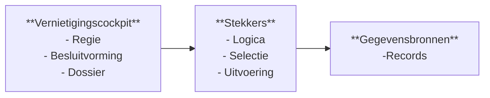

# Architectuur – Vernietigingscockpit ecosysteem

## 1. Doel en scope

Dit document beschrijft de overkoepelende architectuur van het Vernietigingscockpit ecosysteem.
Het document **is normerend bedoeld** en geeft richting aan ontwerp, ontwikkeling, implementatie en gebruik.

Doel van dit document is:
- het vastleggen van het architecturale totaalbeeld
- het expliciet afbakenen van verantwoordelijkheden
- het borgen van consistentie tussen componenten
- het ondersteunen van hergebruik en doorontwikkeling

Dit document beschrijft **geen** technische implementatiedetails.
Implementaties **moeten** aantoonbaar aansluiten op dit architectuurkader.

## 2. Context en probleemstelling

Organisaties beheren informatie verspreid over vele applicaties en gegevensbronnen.
Selectie en vernietiging volgens wet en regelgeving is hierdoor complex en foutgevoelig.

Het Vernietigingscockpit ecosysteem **moet** dit adresseren door:
- centrale en gecontroleerde regie
- decentrale technische uitvoering
- uniforme processen over systemen heen
- volledige audit en verantwoording

Het ecosysteem **moet** toepasbaar zijn in een gefragmenteerd en voortdurend veranderende informatiehuishouding (het digitale landschap).

## 3. Architectuurvisie

De architectuur is gebaseerd op een ecosysteemgedachte, , waarin verantwoordelijkheden expliciet zijn gescheiden.

Daarbij gelden de volgende uitgangspunten:
- de cockpit vervult de rol van regie en besluitvorming
- de Stekker vervult de rol van selectie en technische uitvoering
- de bron bevat en beheert de feitelijke gegevens

Deze rolverdeling geldt onafhankelijk van technische of organisatorische inrichting.
Integratie van Stekker en bron binnen één applicatie is toegestaan, zolang verantwoordelijkheden gescheiden blijven.

De cockpit **weet wat** moet gebeuren.
De stekker **weet hoe** dit technisch gebeurt.
De bron **blijft eigenaar en beheerder** van de gegevens zolang deze bestaan.

Deze verantwoordelijkheden **mogen niet** vermengd worden.

## 4. Architectuurprincipes

De volgende principes **zijn leidend** voor alle onderdelen:

- scheiding van verantwoordelijkheden
- centrale regie, decentrale uitvoering (federatief)
- expliciete scheiding tussen normatief en operationeel
- configuratie boven maatwerk
- generieke en herbruikbare componenten
- volledige audit en traceerbaarheid
- backward compatibility is verplicht
- security en privacy by default
- architectuur volgens Common Ground en NeRDS
- open source en transparantie
- architectuur **schrijft verantwoordelijkheden voor**, maar **schrijft geen technische of organisatorische vorm af**

Afwijkingen van deze principes **moeten** expliciet gemotiveerd en vastgelegd worden.

## 5. Logisch architectuuroverzicht

Het ecosysteem bestaat uit drie hoofdcomponenten:
- Vernietigingscockpit
- Stekkers
- Gegevensbronnen

Deze componenten **moeten** strikt gescheiden blijven.

### 5.1 Overzichtsdiagram

## 6. Hoofdcomponenten

Het ecosysteem bestaat uit drie hoofdcomponenten.
Deze componenten **moeten** strikt gescheiden blijven en **mogen** geen verantwoordelijkheden van elkaar overnemen.

### 6.1 Vernietigingscockpit

De Vernietigingscockpit **is** het centrale regie en besluitvormingscomponent.
De cockpit:
- **moet** vernietigingstaken en workflows beheren
- **moet** beoordeling en accordering ondersteunen
- **moet** dossiers en verantwoordingsinformatie beheren
- **moet** verklaringen van vernietiging genereren

De cockpit **mag geen** selectie in of tegen gegevensbronnen uitvoeren.
De cockpit **mag geen** vernietigingshandelingen tegen gegevensbronnen uitvoeren.

### 6.2 Stekkers

Stekkers **vormen** de technische schakel tussen cockpit en gegevensbronnen.
Stekkers:
- **moeten** selectieregels operationeel interpreteren
- **moeten** vernietigingskandidaten bepalen
- **moeten** na vrijgave vernietiging technisch uitvoeren
- **moeten** uitvoeringsresultaten per vernietigd informatieobject retourneren

Stekkers **mogen** bron‑ en domeinspecifieke logica bevatten.
Stekkers **mogen geen** normatieve besluitvorming uitvoeren.

### 6.3 Bronsystemen

Gegevensbronnen:
- **bevatten** de informatieobjecten
- **blijven** eigenaar en beheerder van de gegevens
- **voeren** de feitelijke vernietiging van gegevens uit

Gegevensbronnen **mogen geen** kennis hebben van cockpitprocessen of normatieve besluitvorming.

## 7. Normatief versus operationeel

De architectuur **maakt verplicht onderscheid** tussen normatief en operationeel.

### 7.1 Normatief

Normatief betreft:
- wat vernietigd mag worden
- onder welke voorwaarden
- op basis van welke besluiten

Normatieve besluitvorming:
- **moet** plaatsvinden in de Vernietigingscockpit
- **moet** door mensen worden uitgevoerd
- **moet** worden vastgelegd in het dossier

Normatieve besluitvorming **mag niet** plaatsvinden in stekkers en/of gegevensbronnen.

### 7.2 Operationeel

Operationeel betreft:
- selectie van concrete informatieobjecten
- technische uitvoering van vernietiging
- foutafhandeling en retries

Operationele logica:
- **moet** plaatsvinden in de Stekkers
- **mag niet** plaatsvinden in de cockpit

## 8. Interactie en verantwoordelijkheden

De verantwoordelijkheden zijn strikt gescheiden:
- de cockpit **moet** regie voeren en besluiten vastleggen
- stekkers **moeten** selectie en vernietiging operationeel uitvoeren
- gegevensbronnen **moeten** de daadwerkelijke vernietiging van gegevens uitvoeren

De cockpit **mag niet** direct communiceren met gegevensbronnen. Alle communicatie **moet** verlopen via stekkers.

## 9. Niet functionele kwaliteitsdoelen

Het ecosysteem **moet** voldoen aan de volgende kwaliteitsdoelen:
- schaalbaarheid over meerdere bronnen
- betrouwbaarheid en herstartbaarheid
- volledige audit en reproduceerbaarheid
- sterke beveiliging en functiescheiding
- beheerbaarheid en configureerbaarheid
- transparantie richting toezicht en controle

Deze kwaliteitsdoelen **zijn richtinggevend** voor alle ontwerpkeuzes.

## 10. Versies en evolutie

Het ecosysteem **moet** kunnen evolueren zonder dat bestaande processen breken.
Daarom geldt:
- uitbreidingen zijn additief
- brekende wijzigingen binnen een major versie zijn niet toegestaan, een separate stekker als uitzondering is mogelijk
- meerdere stekker‑versies **moeten** parallel ondersteund worden
- historische processen **moeten** reproduceerbaar blijven

Versie‑informatie **moet** worden vastgelegd in audit en dossiers.

## 11. Aannames en kaders

### 11.1 Aannames

- selectieregels worden niet centraal geïnterpreteerd
- Feitelijke vernietiging is mogelijk in gegevensbronnen
- organisatorische rollen zijn ingericht

Deze aannames **moeten** expliciet worden gemaakt bij implementatie.

### 11.2 Kaders

Het ecosysteem **moet** aansluiten bij:
- Archiefwet, BIO2, Cybersecuritywet, AVG en aanpalende regelgeving
- Common Ground architectuurprincipes
- NeRDS leidraad
- open source standaarden

## 12. Relatie met verdiepende architectuurdocumenten

Dit document **vormt het bindende architectuurkader** voor:
- architectuur-cockpit.md
- architectuur-stekker.md

Deze documenten **mogen niet** strijdig zijn met dit architectuurkader.