# Sequence diagrams – Vernietigingscockpit ecosysteem

Dit document bevat sequence diagrams van de belangrijkste processen binnen het Vernietigingscockpit ecosysteem.
De diagrammen zijn bedoeld om interactie, verantwoordelijkheden en volgorde van stappen inzichtelijk te maken.

---

## 1. Overzicht kernprocessen

De volgende kernprocessen worden beschreven:
- aanmaken en plannen van een vernietigingstaak
- ophalen van vernietigingskandidaten
- beoordeling en accordering
- starten van vernietiging
- afronding, verklaring en archiveren van vernietiging

## 2. Aanmaken en plannen van een vernietigingstaak

Dit diagram beschrijft hoe een recordmanager een vernietigingstaak aanmaakt op basis van een sjabloon.

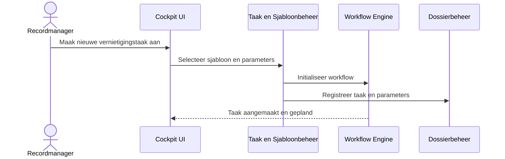

## 3. Ophalen van vernietigingskandidaten
Dit diagram beschrijft hoe de cockpit een selectie start bij een stekker en de lijst met vernietigingskandidaten ophaalt.

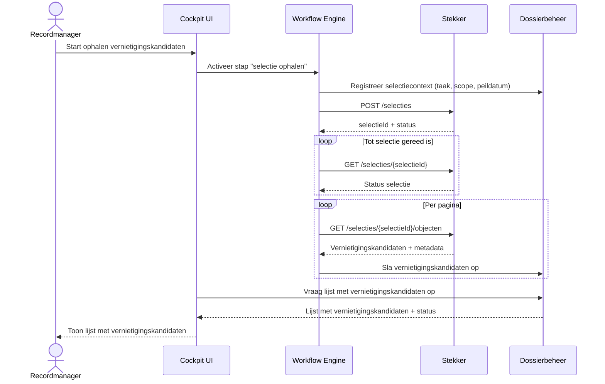

Belangrijk:
- selectie is operationeel
- landelijke selectielijstinterpretatie vindt plaats in de stekker
- de stekker bepaalt vernietigingskandidaten
- de cockpit legt vernietigingskandidaten vast, maar bepaalt ze niet.
- de selectie is herleidbaar via `selectieId`

## 4. Beoordeling door recordmanager
Dit diagram toont de beoordeling van vernietigingskandidaten door de recordmanager.
Dit diagram toont de beoordeling van vernietigingskandidaten door de recordmanager.

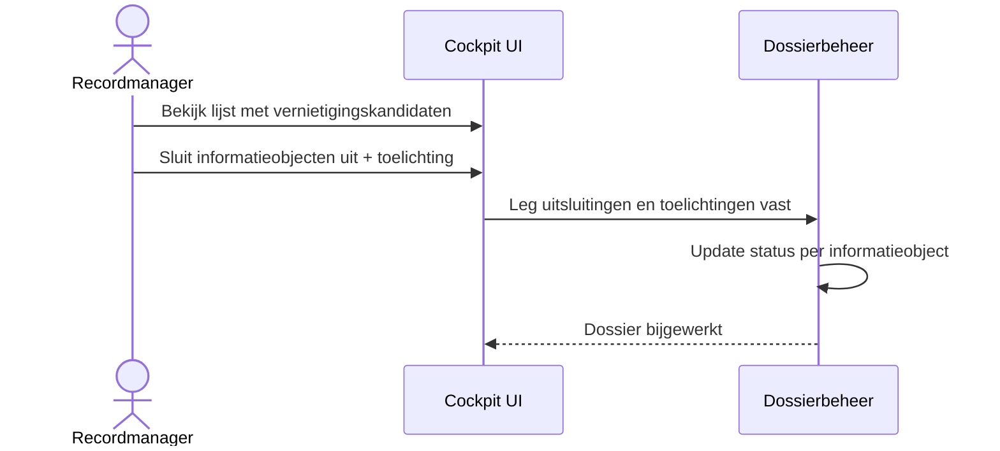

Belangrijk:
- uitsluitingen zijn normatief
- elke uitsluiting heeft een toelichting
- alles wordt vastgelegd in het dossier

## 5. Accordering door proceseigenaar en archivaris
Dit diagram beschrijft de tweestapsaccordering.

Belangrijk:
- functiescheiding is verplicht
- volgorde ligt vast in de workflow
- accordering is onderdeel van het dossier

### 5a. Accordering door proceseigenaar

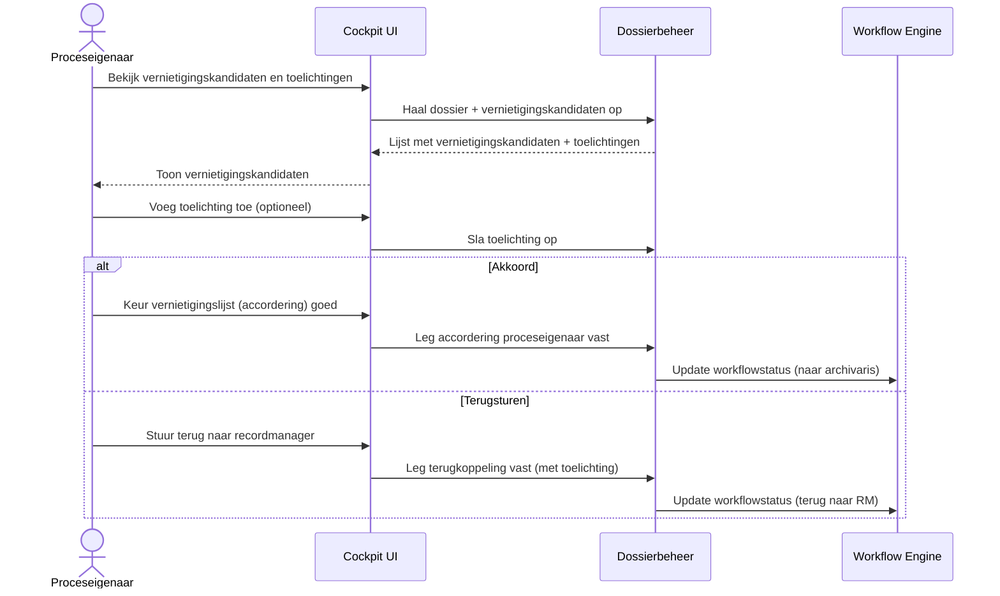

### 5b. Accordering door gemeentearchivaris

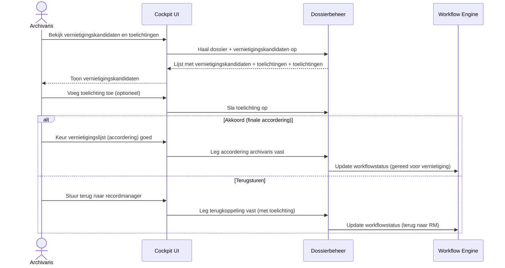

## 6. Uitvoeren van vernietiging
Dit diagram beschrijft hoe de cockpit vernietiging vrijgeeft, een vernietiging start en batches aanbiedt aan de stekker.

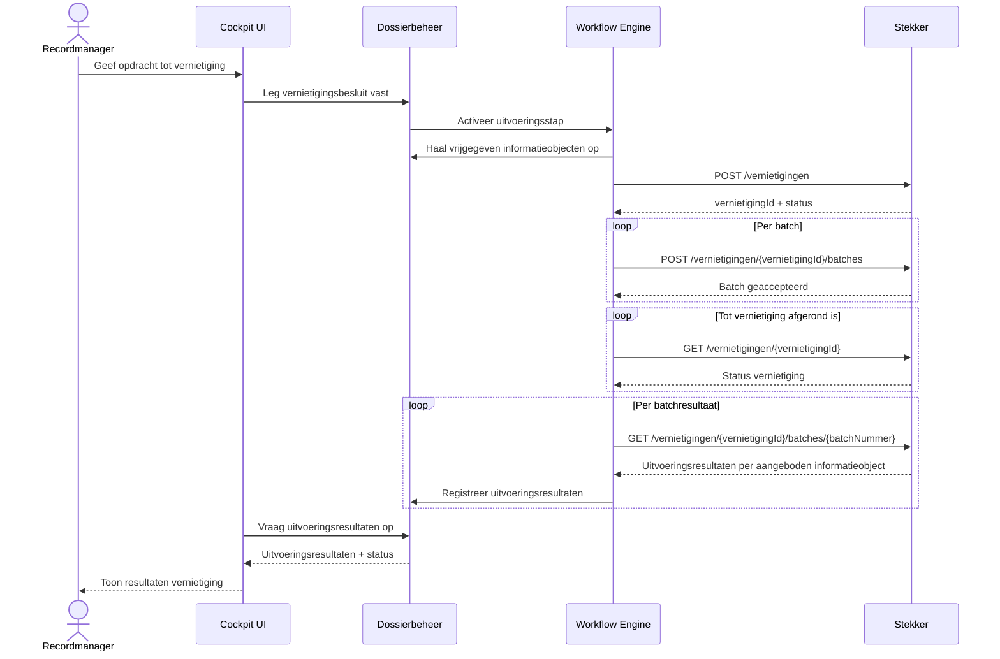

Belangrijk:
- alleen expliciet vrijgegeven informatieobjecten worden aangeboden voor vernietiging
- vernietiging wordt asynchroon uitgevoerd
- batches zijn technische verdelingen van de uitvoering
- de POST op een batch bevestigt acceptatie, maar bevat nog geen definitieve uitvoeringsresultaten
- resultaten worden per aangeboden informatieobject vastgelegd
- de vernietiging is herleidbaar via `vernietigingId`

## 7. Fouten en retries bij vernietiging
Dit diagram laat een vereenvoudigd foutpad zien bij batchverwerking.

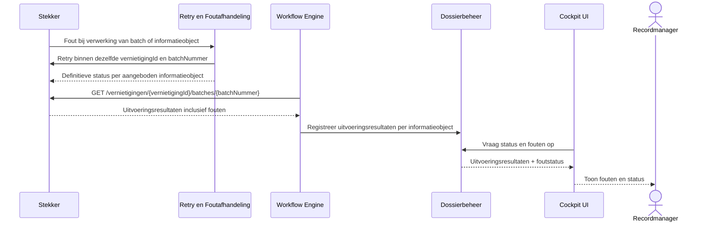

Belangrijk:
- retries vinden plaats in de stekker
- retries blijven gekoppeld aan dezelfde `vernietigingId` en `batchNummer`
- cockpit registreert definitieve uitvoeringsresultaten
- handmatige opvolging is mogelijk

## 8. Genereren van verklaring van vernietiging
Dit diagram beschrijft de afronding van het proces.

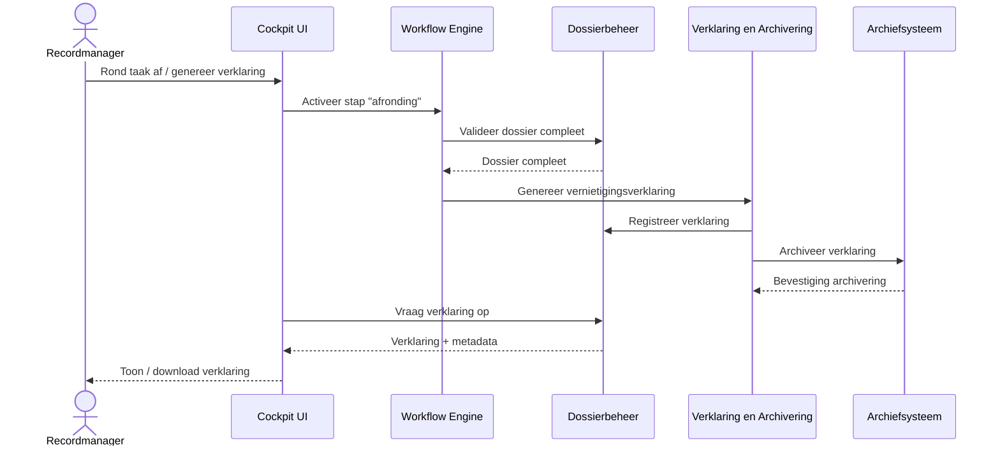

Belangrijk:
- verklaring bevat besluiten en uitvoering
- archivering ondersteunt juridisch bewijs
- proces is hiermee formeel afgesloten

## 9. Overzicht processen  – Functioneel beheerder
- Beheer van stekkers (configuratie)
- Gebruikers- en rollenbeheer
- Monitoring en logging
- Configuratiebeheer
- Versie- en wijzigingsbeheer

## 10. Configureren van een stekker
Dit diagram beschrijft de configuratie van stekkers.

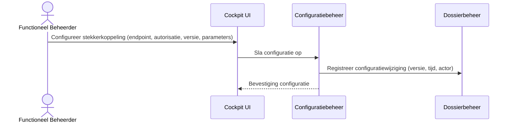

## 11. Gebruikers en rollen beheren
Dit diagram beschrijft de configuratie van gebruikers en rollen.

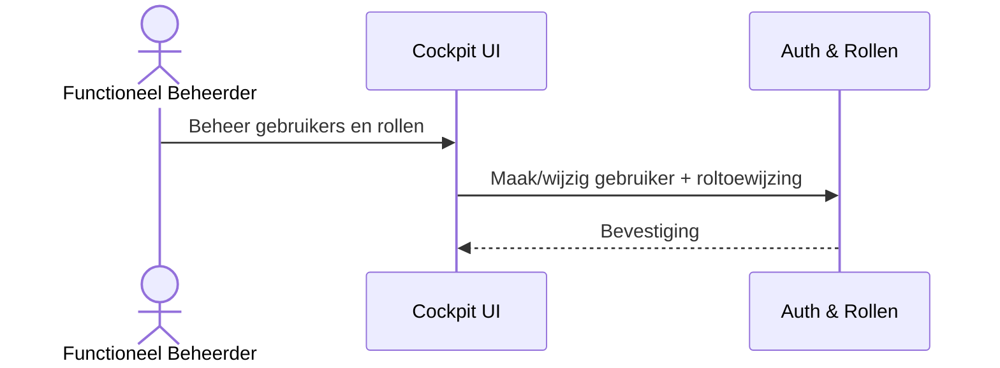

## 12. Inzien logging en monitoring
Dit diagram beschrijft het inzien van logging en monitoring.

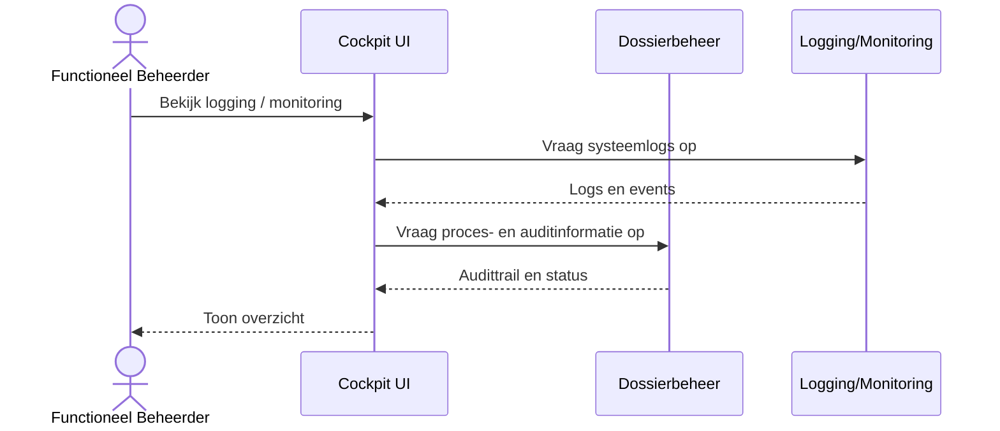