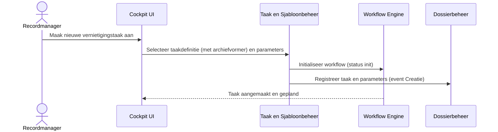
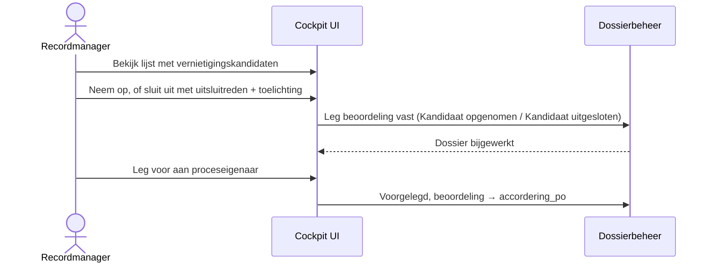
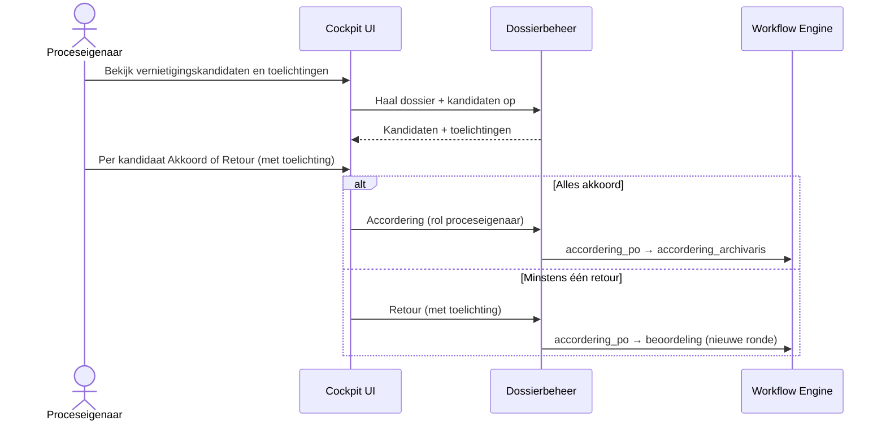
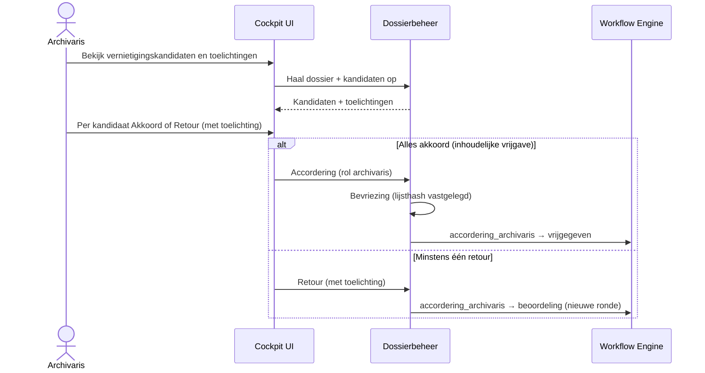
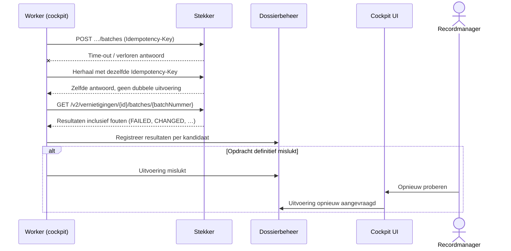
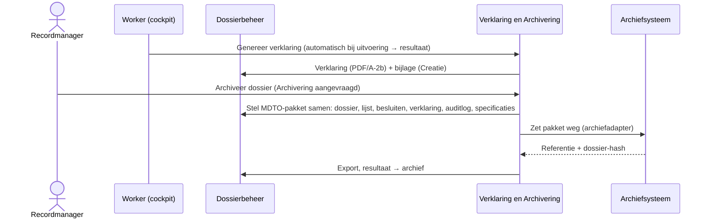
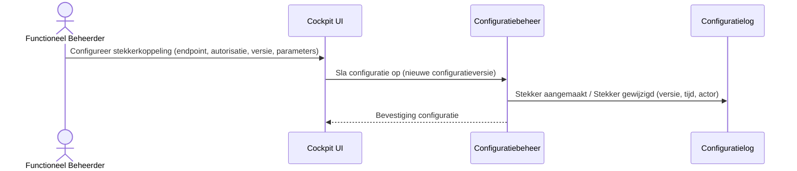
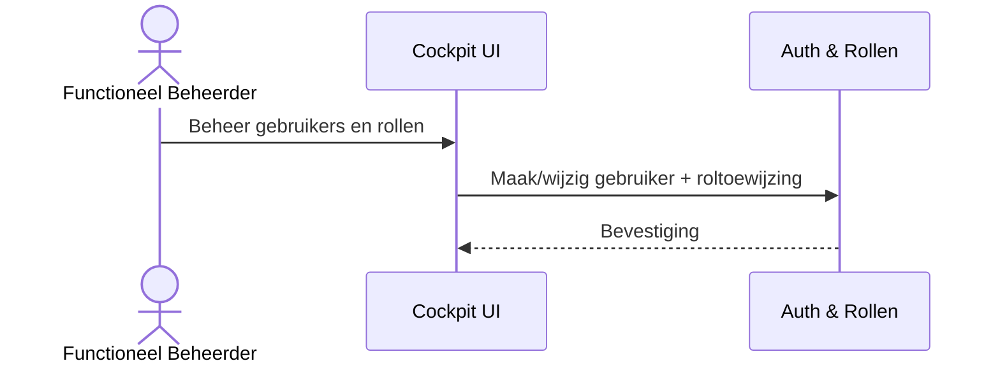
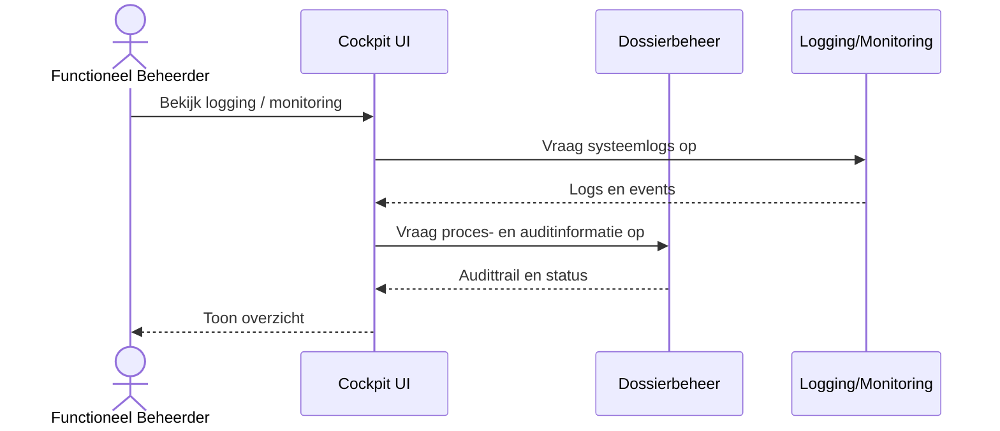
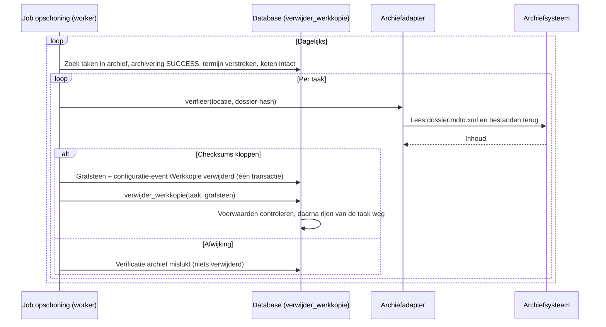

# Sequence diagrams – Vernietigingscockpit ecosysteem

Dit document bevat sequence diagrams van de belangrijkste processen binnen het Vernietigingscockpit-ecosysteem.
De diagrammen maken interactie, verantwoordelijkheden en de volgorde van stappen inzichtelijk.

Stekker-endpoints staan onder `/v2` (Stekker API v2.0.0). Elke `POST` naar een stekker heeft een `Idempotency-Key` (ADR-0004). Events in het auditlog volgen de MDTO EventTypeLijst of de lijst Cockpit-eventtypen (ADR-0005); hieronder staan ze *cursief*.

---

## 1. Overzicht kernprocessen

- aanmaken en plannen van een vernietigingstaak
- ophalen van vernietigingskandidaten
- beoordeling en accordering
- uitvoeren van vernietiging
- verklaring en archivering
- verwijderen van de werkkopie

## 2. Aanmaken en plannen van een vernietigingstaak

```mermaid
sequenceDiagram
    actor RM as Recordmanager
    participant UI as Cockpit UI
    participant Task as Taak en Sjabloonbeheer
    participant WF as Workflow Engine
    participant D as Dossierbeheer

    RM ->> UI: Maak nieuwe vernietigingstaak aan
    UI ->> Task: Selecteer taakdefinitie (met archiefvormer) en parameters
    Task ->> WF: Initialiseer workflow (status init)
    Task ->> D: Registreer taak en parameters (event Creatie)
    WF -->> UI: Taak aangemaakt en gepland
```

## 3. Ophalen van vernietigingskandidaten

```mermaid
sequenceDiagram
    actor RM as Recordmanager
    participant UI as Cockpit UI
    participant WF as Workflow Engine
    participant Stekker
    participant D as Dossierbeheer

    RM ->> UI: Start ophalen vernietigingskandidaten
    UI ->> WF: Activeer stap "selectie ophalen"
    WF ->> D: Registreer selectiecontext (event Selectie aangevraagd)

    WF ->> Stekker: POST /v2/selecties (Idempotency-Key)
    Stekker -->> WF: selectieId + status

    loop Tot selectie gereed is
        WF ->> Stekker: GET /v2/selecties/{selectieId}
        Stekker -->> WF: Status selectie
    end

    loop Per pagina
        WF ->> Stekker: GET /v2/selecties/{selectieId}/vernietigingskandidaten
        Stekker -->> WF: Kandidaten met MDTO-metagegevens
        WF ->> D: Sla kandidaten op; waardering B/N automatisch uitsluiten
    end

    WF ->> D: Alle selecties gereed (event Import), init → beoordeling
    UI ->> D: Vraag kandidaten op
    D -->> UI: Kandidaten + status
    UI -->> RM: Toon lijst met vernietigingskandidaten
```

Belangrijk:
- selectie is operationeel; de toepassing van de selectielijst vindt plaats in de stekker;
- de stekker bepaalt de kandidaten en levert hun MDTO-metagegevens; de cockpit legt ze vast, maar bepaalt ze niet;
- een kandidaat is precies één MDTO-informatieobject (Archief, Serie, Dossier of Archiefstuk);
- kandidaten met een andere waardering dan V sluit de cockpit automatisch uit (*Kandidaat uitgesloten*, reden *Waardering niet V*);
- de selectie is herleidbaar via `selectieId`.

## 4. Beoordeling door recordmanager

```mermaid
sequenceDiagram
    actor RM as Recordmanager
    participant UI as Cockpit UI
    participant D as Dossierbeheer

    RM ->> UI: Bekijk lijst met vernietigingskandidaten
    RM ->> UI: Neem op, of sluit uit met uitsluitreden + toelichting
    UI ->> D: Leg beoordeling vast (Kandidaat opgenomen / Kandidaat uitgesloten)
    D -->> UI: Dossier bijgewerkt
    RM ->> UI: Leg voor aan proceseigenaar
    UI ->> D: Voorgelegd, beoordeling → accordering_po
```

Belangrijk:
- uitsluitingen zijn normatief;
- elke uitsluiting heeft een uitsluitreden (Cockpit-uitsluitredenen) en een toelichting; een lopend Woo- of AVG-verzoek, bezwaar of geschil leidt tot uitsluiting (*Lopend verzoek of procedure*);
- alles wordt vastgelegd in het dossier.

## 5. Accordering door proceseigenaar en archivaris

Belangrijk:
- functiescheiding is verplicht;
- de volgorde ligt vast in de workflow;
- accordering is onderdeel van het dossier (*Accordering*, met de rol in het event).

### 5a. Accordering door proceseigenaar

```mermaid
sequenceDiagram
    actor PO as Proceseigenaar
    participant UI as Cockpit UI
    participant D as Dossierbeheer
    participant WF as Workflow Engine

    PO ->> UI: Bekijk vernietigingskandidaten en toelichtingen
    UI ->> D: Haal dossier + kandidaten op
    D -->> UI: Kandidaten + toelichtingen
    PO ->> UI: Per kandidaat Akkoord of Retour (met toelichting)

    alt Alles akkoord
        UI ->> D: Accordering (rol proceseigenaar)
        D ->> WF: accordering_po → accordering_archivaris
    else Minstens één retour
        UI ->> D: Retour (met toelichting)
        D ->> WF: accordering_po → beoordeling (nieuwe ronde)
    end
```

### 5b. Accordering door gemeentearchivaris

```mermaid
sequenceDiagram
    actor AR as Archivaris
    participant UI as Cockpit UI
    participant D as Dossierbeheer
    participant WF as Workflow Engine

    AR ->> UI: Bekijk vernietigingskandidaten en toelichtingen
    UI ->> D: Haal dossier + kandidaten op
    D -->> UI: Kandidaten + toelichtingen
    AR ->> UI: Per kandidaat Akkoord of Retour (met toelichting)

    alt Alles akkoord (inhoudelijke vrijgave)
        UI ->> D: Accordering (rol archivaris)
        D ->> D: Bevriezing (lijsthash vastgelegd)
        D ->> WF: accordering_archivaris → vrijgegeven
    else Minstens één retour
        UI ->> D: Retour (met toelichting)
        D ->> WF: accordering_archivaris → beoordeling (nieuwe ronde)
    end
```

## 6. Uitvoeren van vernietiging

```mermaid
sequenceDiagram
    actor RM as Recordmanager
    participant UI as Cockpit UI
    participant D as Dossierbeheer
    participant WF as Workflow Engine
    participant Stekker

    RM ->> UI: Geef opdracht tot vernietiging
    UI ->> D: Controleer lijsthash; Vernietigingsopdracht
    D ->> WF: vrijgegeven → uitvoering

    WF ->> D: Haal vrijgegeven kandidaten op (per stekker)
    WF ->> Stekker: POST /v2/vernietigingen (Idempotency-Key)
    Stekker -->> WF: vernietigingId, status IDLE
    WF ->> D: Uitvoering gestart

    loop Per batch
        WF ->> Stekker: POST /v2/vernietigingen/{id}/batches (kandidaat + identificatie)
        Stekker -->> WF: Batch geaccepteerd
        WF ->> D: Batch aangeboden
    end

    WF ->> Stekker: POST /v2/vernietigingen/{id}/vrijgeven (aantalBatches, aantalKandidaten)
    Stekker -->> WF: status RUNNING + vernietigingsmethode

    loop Tot vernietiging afgerond is
        WF ->> Stekker: GET /v2/vernietigingen/{id}
        Stekker -->> WF: Status en tellingen
    end

    loop Per batchresultaat
        WF ->> Stekker: GET /v2/vernietigingen/{id}/batches/{batchNummer}
        Stekker -->> WF: Resultaat per kandidaat (bij SUCCESS: event Vernietigen + tijdstip)
        WF ->> D: Vernietigen / Niet vernietigd, Batch verwerkt
    end

    loop Per kandidaat met SUCCESS
        WF ->> Stekker: GET /v2/vernietigingen/{id}/specificaties/{kandidaatId}
        Stekker -->> WF: MDTO-XML-specificatie
        WF ->> D: Bewaar specificatie + checksum
    end

    WF ->> D: Uitvoering afgerond, uitvoering → resultaat
    UI ->> D: Vraag uitvoeringsresultaten op
    D -->> UI: Resultaten + status
    UI -->> RM: Toon resultaten vernietiging
```

Belangrijk:
- alleen expliciet vrijgegeven kandidaten worden aangeboden, met hun identificatie letterlijk zoals geselecteerd;
- vernietiging wordt asynchroon uitgevoerd; batches zijn technische verdelingen;
- een batch-POST bevestigt acceptatie, maar bevat nog geen resultaten;
- alleen `SUCCESS` telt als vernietigd; `NOT_FOUND` is geen bewijs van vernietiging;
- de vernietiging is herleidbaar via `vernietigingId`.

## 7. Fouten en retries bij vernietiging

```mermaid
sequenceDiagram
    participant WF as Worker (cockpit)
    participant Stekker
    participant D as Dossierbeheer
    participant UI as Cockpit UI
    actor RM as Recordmanager

    WF ->> Stekker: POST …/batches (Idempotency-Key)
    Stekker --x WF: Time-out / verloren antwoord
    WF ->> Stekker: Herhaal met dezelfde Idempotency-Key
    Stekker -->> WF: Zelfde antwoord, geen dubbele uitvoering

    WF ->> Stekker: GET /v2/vernietigingen/{id}/batches/{batchNummer}
    Stekker -->> WF: Resultaten inclusief fouten (FAILED, CHANGED, …)
    WF ->> D: Registreer resultaten per kandidaat

    alt Opdracht definitief mislukt
        WF ->> D: Uitvoering mislukt
        RM ->> UI: Opnieuw proberen
        UI ->> D: Uitvoering opnieuw aangevraagd
    end
```

Belangrijk:
- retries blijven gekoppeld aan dezelfde `vernietigingId`, hetzelfde `batchNummer` en dezelfde `Idempotency-Key`;
- de cockpit registreert de definitieve resultaten;
- handmatige opvolging is mogelijk.

## 8. Verklaring en archivering

```mermaid
sequenceDiagram
    actor RM as Recordmanager
    participant WF as Worker (cockpit)
    participant D as Dossierbeheer
    participant V as Verklaring en Archivering
    participant Z as Archiefsysteem

    WF ->> V: Genereer verklaring (automatisch bij uitvoering → resultaat)
    V ->> D: Verklaring (PDF/A-2b) + bijlage (Creatie)

    RM ->> V: Archiveer dossier (Archivering aangevraagd)
    V ->> D: Stel MDTO-pakket samen: dossier, lijst, besluiten, verklaring, auditlog, specificaties
    V ->> Z: Zet pakket weg (archiefadapter)
    Z -->> V: Referentie + dossier-hash
    V ->> D: Export, resultaat → archief
```

Belangrijk:
- de verklaring bevat de specificatie van de vernietigde archiefbescheiden, de wijze en het tijdstip van vernietiging (art. 8 Archiefbesluit), en de accorderingen;
- het dossier heeft vast de waardering *B – Blijvend te bewaren*;
- archivering naar een archiefsysteem is *Export*, geen *Overbrenging*: het zorgdragerschap gaat niet over;
- het proces is hiermee formeel afgesloten.

## 9. Overzicht processen – Functioneel beheerder

- beheer van stekkers (configuratie)
- gebruikers- en rollenbeheer
- monitoring en logging
- configuratiebeheer
- versie- en wijzigingsbeheer

## 10. Configureren van een stekker

```mermaid
sequenceDiagram
    actor FB as Functioneel Beheerder
    participant UI as Cockpit UI
    participant C as Configuratiebeheer
    participant D as Configuratielog

    FB ->> UI: Configureer stekkerkoppeling (endpoint, autorisatie, versie, parameters)
    UI ->> C: Sla configuratie op (nieuwe configuratieversie)
    C ->> D: Stekker aangemaakt / Stekker gewijzigd (versie, tijd, actor)
    C -->> UI: Bevestiging configuratie
```

## 11. Gebruikers en rollen beheren

```mermaid
sequenceDiagram
    actor FB as Functioneel Beheerder
    participant UI as Cockpit UI
    participant IAM as Auth & Rollen

    FB ->> UI: Beheer gebruikers en rollen
    UI ->> IAM: Maak/wijzig gebruiker + roltoewijzing
    IAM -->> UI: Bevestiging
```

## 12. Inzien logging en monitoring

```mermaid
sequenceDiagram
    actor FB as Functioneel Beheerder
    participant UI as Cockpit UI
    participant D as Dossierbeheer
    participant LOG as Logging/Monitoring

    FB ->> UI: Bekijk logging / monitoring
    UI ->> LOG: Vraag systeemlogs op
    LOG -->> UI: Logs en events
    UI ->> D: Vraag proces- en auditinformatie op
    D -->> UI: Audittrail en status
    UI -->> FB: Toon overzicht
```

## 13. Verwijderen van de werkkopie (ADR-0006)

```mermaid
sequenceDiagram
    participant J as Job opschoning (worker)
    participant DB as Database (verwijder_werkkopie)
    participant A as Archiefadapter
    participant Z as Archiefsysteem

    loop Dagelijks
        J ->> DB: Zoek taken in archief, archivering SUCCESS, termijn verstreken, keten intact
        loop Per taak
            J ->> A: verifieer(locatie, dossier-hash)
            A ->> Z: Lees dossier.mdto.xml en bestanden terug
            Z -->> A: Inhoud
            alt Checksums kloppen
                J ->> DB: Grafsteen + configuratie-event Werkkopie verwijderd (één transactie)
                J ->> DB: verwijder_werkkopie(taak, grafsteen)
                DB ->> DB: Voorwaarden controleren, daarna rijen van de taak weg
            else Afwijking
                J ->> DB: Verificatie archief mislukt (niets verwijderd)
            end
        end
    end
```

Belangrijk:
- het blijvende exemplaar staat in het archiefsysteem; verwijderen van de werkkopie is géén *Vernietigen*;
- de database dwingt de voorwaarden af; de app-rol kan zelf niets verwijderen;
- de grafsteen houdt het gearchiveerde auditlog controleerbaar.
