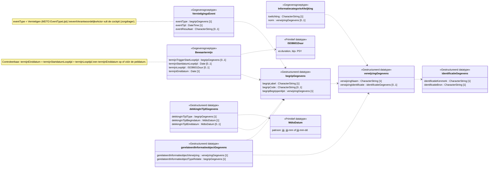
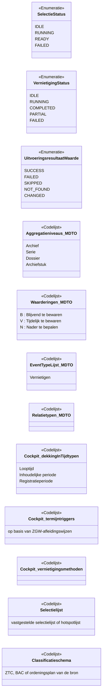

# MIM-informatiemodel Stekker API (v2)

## 1. Doel

Dit document geeft het informatiemodel van de Stekker API v2 weer als **logisch informatiemodel volgens MIM** (Metamodel Informatie Modellering, Geonovum, niveau 3), getekend als UML-klassendiagram in Mermaid.

Het is een afgeleide weergave van:

- `api-informatiemodel.md` (betekenis van de gegevens);
- `stekker-openapi-spec.yaml` v2.0.0 (structuur, kardinaliteit en verplichte velden).

Bij een verschil is de OpenAPI-specificatie leidend voor verplichte velden en `api-informatiemodel.md` voor de betekenis. MDTO 1.0 / MDTO-XML 1.0.1 is leidend voor naamgeving (ADR-0005).

---

## 2. Gebruikte MIM-metaklassen

| MIM-stereotype | Gebruik in dit model | In de OpenAPI-spec |
|--------|--------|--------|
| «Objecttype» | Selectie, Vernietigingskandidaat, Vernietigingsuitvoering, Batch, Uitvoeringsresultaat, Specificatie | Resource-schema's |
| «Objecttype» (extern, MDTO) | Informatieobject | Niet als schema; alleen in de MDTO-XML-specificatie |
| «Gegevensgroeptype» | Bewaartermijn, InformatiecategorieAfwijking, VernietigingsEvent | Geneste objecten met eigen schema |
| «Gestructureerd datatype» | MDTO-gegevensgroepen: identificatieGegevens, verwijzingGegevens, begripGegevens, dekkingInTijdGegevens, gerelateerdInformatieobjectGegevens | Herbruikbare schema's |
| «Primitief datatype» | MdtoDatum, ISO8601Duur | `string` met `pattern` |
| «Enumeratie» | SelectieStatus, VernietigingStatus, UitvoeringsresultaatWaarde | `enum` |
| «Codelijst» | De begrippenlijsten (MDTO en Cockpit-eigen) | `begripBegrippenlijst` binnen `begripGegevens` |
| «Relatiesoort» | Associaties tussen objecttypen | Verwijzing via id of nesting |
| Generalisatie | Vernietigingskandidaat is een MDTO-informatieobject | – |

MIM-standaarddatatypen: `CharacterString`, `Integer`, `Date`, `DateTime`.

**Notatie.** Kardinaliteit staat achter het attribuut, bijvoorbeeld `[0..1]`. Een `[1]` of `[1..*]` betekent verplicht volgens de OpenAPI-spec. Attributen met het label `«cockpituitbreiding»` hebben geen MDTO-attribuut.

---

## 3. Overzicht objecttypen en relatiesoorten

```mermaid
classDiagram
  direction LR

  class Selectie {
    <<Objecttype>>
    selectieId : CharacterString [1]
    peildatum : Date [0..1]
    selectietijdstip : DateTime [0..1]
    status : SelectieStatus [1]
    totaalKandidaten : Integer [0..1]
    totaalObjecten : Integer [0..1]
    totaalBetrokkenen : Integer [0..1]
    stekkerNaam : CharacterString [0..1]
    stekkerOmschrijving : CharacterString [0..1]
    stekkerversie : CharacterString [0..1]
    configuratieversie : CharacterString [0..1]
    apiVersie : CharacterString [0..1]
    aantalWaarschuwingen : Integer [0..1]
    aantalFouten : Integer [0..1]
  }

  class Informatieobject {
    <<Objecttype>>
    MDTO 1.0 - extern
  }

  class Vernietigingskandidaat {
    <<Objecttype>>
    vernietigingskandidaatId : CharacterString [1]
    identificatie : identificatieGegevens [1..*]
    naam : CharacterString [1]
    omschrijving : CharacterString [0..*]
    aggregatieniveau : begripGegevens [1]
    classificatie : begripGegevens [0..*]
    dekkingInTijd : dekkingInTijdGegevens [0..*]
    waardering : begripGegevens [1]
    informatiecategorie : begripGegevens [1]
    gerelateerdInformatieobject : gerelateerdInformatieobjectGegevens [0..*]
    archiefvormer : verwijzingGegevens [0..*]
    activiteit : verwijzingGegevens [0..1]
    aantalObjecten : Integer [0..1] «cockpituitbreiding» - direct onderliggend
    aantalBetrokkenen : Integer [0..1] «cockpituitbreiding»
    toelichting : CharacterString [0..1] «cockpituitbreiding»
  }

  class Vernietigingsuitvoering {
    <<Objecttype>>
    vernietigingId : CharacterString [1]
    cockpitTaakId : CharacterString [1]
    vernietigingsdossierId : CharacterString [0..1]
    besluitReferentie : CharacterString [1]
    status : VernietigingStatus [1]
    starttijd : DateTime [0..1]
    eindtijd : DateTime [0..1]
    totaalKandidaten : Integer [0..1]
    totaalObjecten : Integer [0..1]
    totaalBatches : Integer [0..1]
    ontvangenBatches : Integer [0..1]
    verwerkteBatches : Integer [0..1]
    succesvolVernietigd : Integer [0..1]
    mislukt : Integer [0..1]
    overgeslagen : Integer [0..1]
    gewijzigd : Integer [0..1]
    nietGevonden : Integer [0..1]
    stekkerNaam : CharacterString [0..1]
    stekkerOmschrijving : CharacterString [0..1]
    stekkerversie : CharacterString [0..1]
    configuratieversie : CharacterString [0..1]
    vernietigingsmethode : begripGegevens [0..1]
    vernietigingsmethodeToelichting : CharacterString [0..1]
    aantalWaarschuwingen : Integer [0..1]
    aantalFouten : Integer [0..1]
  }

  class Batch {
    <<Objecttype>>
    batchNummer : Integer [1]
  }

  class Uitvoeringsresultaat {
    <<Objecttype>>
    identificatie : identificatieGegevens [1..*]
    batchNummer : Integer [0..1]
    resultaat : UitvoeringsresultaatWaarde [1]
    bronEventReferentie : CharacterString [0..1] «cockpituitbreiding»
    foutcode : CharacterString [0..1]
    foutmelding : CharacterString [0..1]
    bronstatus : CharacterString [0..1]
    logReference : CharacterString [0..1]
    correlatieId : CharacterString [0..1]
    toelichting : CharacterString [0..1]
  }

  class Specificatie {
    <<Objecttype>>
    MDTO-XML 1.0.1 document
  }

  class Bewaartermijn {
    <<Gegevensgroeptype>>
  }
  class InformatiecategorieAfwijking {
    <<Gegevensgroeptype>>
  }
  class VernietigingsEvent {
    <<Gegevensgroeptype>>
  }

  Informatieobject <|-- Vernietigingskandidaat

  Selectie "1" --> "0..*" Vernietigingskandidaat : bevat
  Selectie "1" <-- "0..*" Vernietigingsuitvoering : gebaseerdOp
  Vernietigingsuitvoering "1" *-- "1..*" Batch : bestaatUit
  Batch "0..*" --> "1..*" Vernietigingskandidaat : teVernietigenKandidaat
  Vernietigingsuitvoering "1" *-- "0..*" Uitvoeringsresultaat : levert
  Uitvoeringsresultaat "0..*" --> "1" Vernietigingskandidaat : betreft
  Uitvoeringsresultaat "1" --> "0..1" Specificatie : heeftSpecificatie
  Specificatie "1" --> "1" Informatieobject : beschrijftVernietigd
  Informatieobject "1" --> "0..*" Informatieobject : bevatOnderdeel
  Informatieobject "0..*" --> "0..*" Informatieobject : isOnderdeelVan

  Vernietigingskandidaat "1" *-- "1" Bewaartermijn : bewaartermijn
  Vernietigingskandidaat "1" *-- "0..1" InformatiecategorieAfwijking : informatiecategorieAfwijking
  Uitvoeringsresultaat "1" *-- "0..1" VernietigingsEvent : event

  note for Uitvoeringsresultaat "Precies één per aangeboden kandidaat.\nBij resultaat SUCCESS: event [1] en Specificatie [1].\nOnderdelen gewijzigd sinds selectie: CHANGED voor de hele kandidaat (DR-04)."
  note for Vernietigingsuitvoering "vernietigingsmethode en -Toelichting\nverplicht vanaf status RUNNING (B-M4)."
  note for Vernietigingskandidaat "vernietigingskandidaatId: uniek binnen één selectie (ADR-0007 DR-02).\nObjectidentiteit = identificatie (DR-01).\naggregatieniveau: Archief, Serie, Dossier of Archiefstuk (B-M2, DR-03).\nwaardering B of N: cockpit sluit automatisch uit (B-M1)."
```

Toelichting op de relatiesoorten:

| Relatiesoort | Van → naar | In de API |
|--------|--------|--------|
| bevat | Selectie → Vernietigingskandidaat | `GET /selecties/{selectieId}/vernietigingskandidaten` (gepagineerd) |
| gebaseerdOp | Vernietigingsuitvoering → Selectie | Attribuut `selectieId` |
| bestaatUit | Vernietigingsuitvoering → Batch | `PUT /vernietigingen/{vernietigingId}/batches/{batchNummer}` |
| teVernietigenKandidaat | Batch → Vernietigingskandidaat | `TeVernietigenKandidaat`: `vernietigingskandidaatId` + `identificatie`, letterlijk uit de selectie |
| levert | Vernietigingsuitvoering → Uitvoeringsresultaat | `BatchResultaat.resultaten` |
| betreft | Uitvoeringsresultaat → Vernietigingskandidaat | Attribuut `vernietigingskandidaatId` |
| heeftSpecificatie | Uitvoeringsresultaat → Specificatie | `GET /vernietigingen/{vernietigingId}/specificaties/{vernietigingskandidaatId}` |
| isOnderdeelVan / bevatOnderdeel | Informatieobject → Informatieobject | `isOnderdeelVan` op de kandidaat; `bevatOnderdeel` alleen in de specificatie, precies de onderdelen uit de momentopname (ADR-0007, DR-04) |

---

## 4. Gegevensgroeptypen en MDTO-gestructureerde datatypen

**Opmerking.** De relatie `isOnderdeelVan` is in de API een attribuut `isOnderdeelVan : verwijzingGegevens [0..*]` en in §3 als relatiesoort getekend.

---

## 5. Enumeraties en codelijsten

| Attribuut | Codelijst | Open/gesloten |
|--------|--------|--------|
| Vernietigingskandidaat.aggregatieniveau | Aggregatieniveaus MDTO (beperkt tot Archief, Serie, Dossier, Archiefstuk) | Open, hier beperkt |
| Vernietigingskandidaat.waardering | Waarderingen MDTO | Gesloten |
| Vernietigingskandidaat.classificatie | Classificatieschema van de bron | – |
| Vernietigingskandidaat.informatiecategorie | Selectielijst of hotspotlijst | – |
| dekkingInTijdGegevens.dekkingInTijdType | Cockpit-dekkingInTijdtypen | Open |
| Bewaartermijn.termijnTriggerStartLooptijd | Cockpit-termijntriggers | Open |
| gerelateerdInformatieobjectGegevens.gerelateerdInformatieobjectTypeRelatie | Relatietypen (informatieobject) MDTO | Open |
| VernietigingsEvent.eventType | EventTypeLijst MDTO | Open |
| Vernietigingsuitvoering.vernietigingsmethode | Cockpit-vernietigingsmethoden | Open |

De waarden van de Cockpit-eigen lijsten staan in `designrules/begrippenlijsten/`.

---

## 6. Wat niet in het model staat

- **Berichtschema's** zonder eigen betekenis in het domein: `SelectieStart`, `VernietigingStart`, `VernietigingVrijgave`, `VernietigingskandidatenPagina`, `VernietigingBatch`, `BatchResultaat` en `Fout`. Ze transporteren de objecttypen hierboven. De vrijgave-aantallen komen terug als `totaalBatches` en `totaalKandidaten` op Vernietigingsuitvoering.
- **Cockpit-eigen gegevens** (taak, beoordeling, accordering, uitsluiting, audittrail, vernietigingsdossier, verklaring); zie `api-informatiemodel.md` §2.2.

## 7. Beperkingen van de Mermaid-weergave

- Mermaid kent geen MIM-packages en geen tagged values (zoals definitie, herkomst, patroon). Die staan in `api-informatiemodel.md` en in de OpenAPI-spec.
- Constraints staan als `note` in het diagram, niet als formele OCL.
- Gegevensgroepen zijn als compositie (`*--`) getekend; in MIM is dat de metaklasse «Gegevensgroep» tussen objecttype en gegevensgroeptype.
